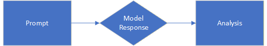
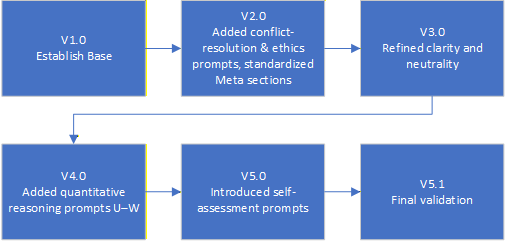
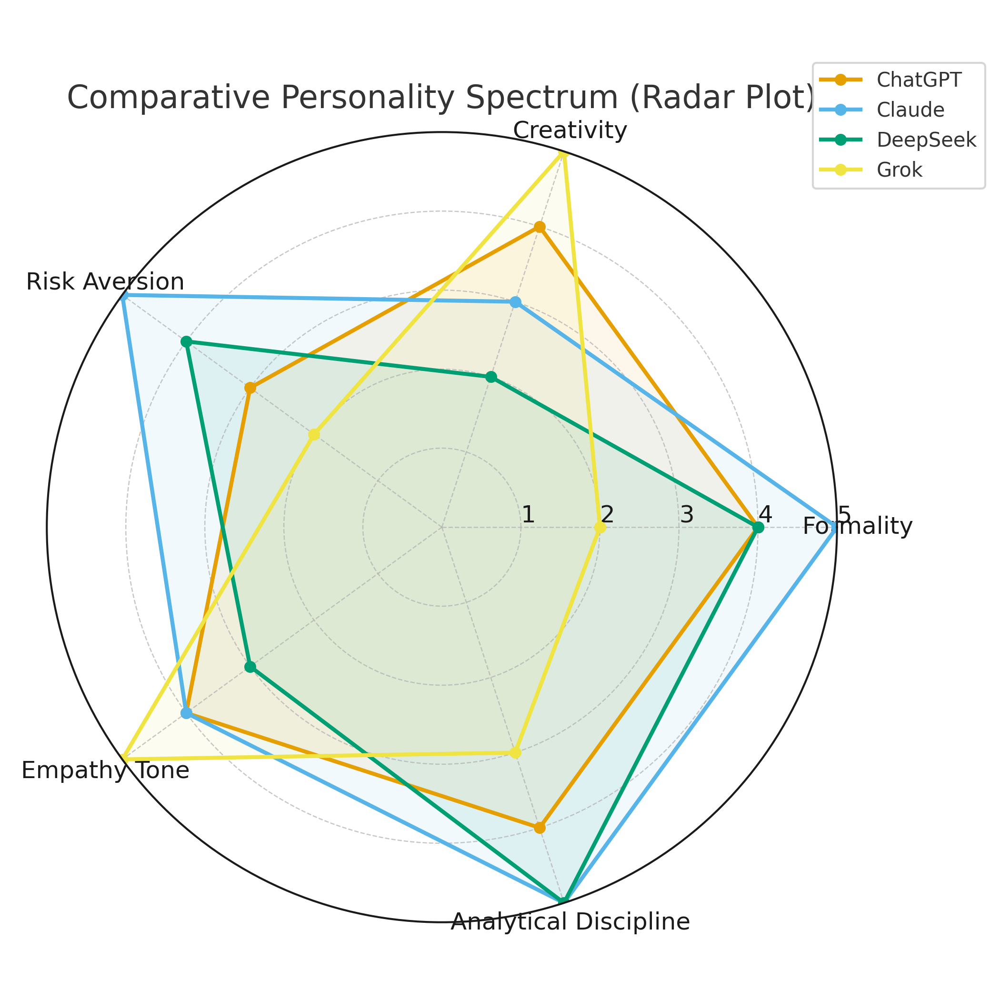

# Multi-Model Personality Analysis and Evaluation Study  
**Technical Report v1.0 (November 2025)**  
**Author:** Russell Nida  
**License:** CC BY-NC-SA 4.0

---

## 🧠 Overview

The **Multi-Model Personality Analysis and Evaluation Study** introduces a reproducible framework for analyzing the consistent behavioral signatures—termed **architectural personalities**—expressed by large language models (LLMs).  
Using a validated diagnostic prompt suite and multi-phase evaluation methodology, this study compares the behavioral tendencies of:

- **ChatGPT (GPT-5)**
- **Claude 3.5 Sonnet**
- **DeepSeek-V2**
- **Grok-4**

The report characterizes reasoning styles, tone, epistemic posture, and meta-cognitive behavior, demonstrating that LLMs display stable, model-specific patterns under controlled conditions.

---

## 📘 Repository Contents

```
/
├── docs/
│   ├── Multi-Model Personality Analysis and Evaluation Study.docx
│   ├── Multi-Model Personality Analysis and Evaluation Study.pdf
│   └── Multi-Model Personality Analysis and Evaluation Study.md
│
├── figures/
│   ├── Figure_1.png
│   ├── Figure_2.png
│   ├── Figure_3.png
│   ├── Figure_4.png
│   ├── Figure_5.png
│   └── Figure_6.png
│
└── README.md
```

### **Direct Links**
- 📄 **[PDF Version](docs/Multi-Model%20Personality%20Analysis%20and%20Evaluation%20Study.pdf)**
- 📝 **[Markdown Version](docs/Multi-Model%20Personality%20Analysis%20and%20Evaluation%20Study.md)**
- 🖊️ **[Word Version](docs/Multi-Model%20Personality%20Analysis%20and%20Evaluation%20Study.docx)**  
- 🖼️ **[Figures Folder](figures/)**

---

## 🎯 Purpose of the Study

Traditional LLM evaluations focus on accuracy, safety, and benchmark performance.  
This study focuses on **how models think**, not just **what they output**.

It introduces:

### **✔ A Diagnostic Prompt Suite (v5.1 Final)**  
20 tasks spanning reasoning, tone, ethics, creativity, and self-reflection.

### **✔ A Multi-Round Validation Workflow**  
Models critique and refine the prompt suite from versions 1.0 → 5.1.

### **✔ A Behavior-Based Comparative Method**  
Quantitative rubrics + qualitative thematic coding.

### **✔ The Model Personality Atlas**  
A structured characterization of each model’s behavioral tendencies.

---

## 📊 Key Findings

### **1. Stable Behavioral Patterns Exist Across Models**  
Each model exhibits distinct reasoning preferences and tone signatures.

### **2. “Architectural Personality” Reflects Alignment Philosophy**  
Traits emerge from training objectives, not stochastic sampling.

### **3. Cross-Model Divergence and Convergence Are Quantifiable**  
Some tasks show strong consistency, others reveal sharp differences.

### **4. Groundwork for Multi-Model Workflows**  
Understanding behavioral tendencies improves role-assignment in hybrid systems  
(evaluator, explainer, summarizer, synthesizer, etc.).

---

## 🧪 Methodology Summary

The study uses a **five-phase research workflow**:

1. **Instrument Development & Validation**  
2. **Cross-Model Comparative Testing**  
3. **Behavioral Analysis & Synthesis**  
4. **Integration & Verification**  
5. **Replication & Governance**

All prompts, scoring methods, and synthesis steps are version-controlled and reproducible.

---

## 📂 Figures

All report figures are stored in the `/figures` directory:

| Figure | Description |
|--------|-------------|
| Figure 1 | Conceptual Map: Prompt → Response → Traits |
| Figure 2 | Research Design Overview |
| Figure 3 | Prompt Suite Evolution (v1.0 → v5.1) |
| Figure 4 | Comparative Profiles & Spectrum |
| Figure 5 | Behavioral Divergence Mapping |
| Figure 6 | Five-Phase Methodology |

Browse figures here:  
➡️ **[figures/](figures/)**

### 🔍 Figures Preview (Thumbnails)

<p align="center">
  
  
</p>

<p align="center">
  
  
</p>

<p align="center">
  
  
</p>

---

## 🔍 Citation

If referencing this technical report, use the following citation format:

```text
Nida, R. (2025). Multi-Model Personality Analysis and Evaluation Study: 
A Framework for Analyzing Personality Expression in Large Language Models. 
Technical Report v1.0. https://github.com/russnida-repo/Multi-Model-Personality-Analysis-and-Evaluation-Study
```

---

## 🔒 License

This project is released under:

**Creative Commons Attribution–NonCommercial–ShareAlike 4.0 (CC BY-NC-SA 4.0)**

You may share and adapt the work for non-commercial purposes, with attribution, and under the same license.

---

## 🧭 Future Directions

Planned enhancements include:

- Public release of Prompt Suite v5.1 as standalone repo  
- Jupyter notebook for running diagnostic tasks  
- Multi-model comparison dashboards  
- Longitudinal drift tracking  
- Companion guide for integrating LLM behavioral insights into hybrid pipelines

---

## 🤝 Contributing

Contributions, replications, and extensions of this framework are welcome.  
Please open an issue or submit a pull request on GitHub.

---

## 🙏 Acknowledgments

Special thanks to the large multimodal model community whose work on interpretability, alignment, and behavioral diagnostics inspired this study.
